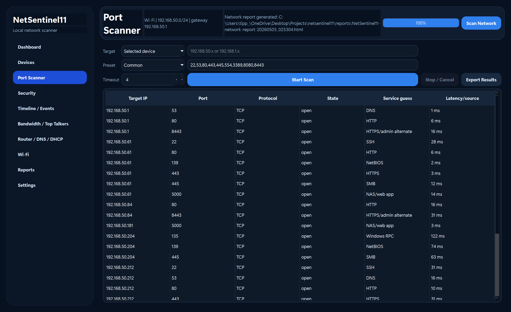
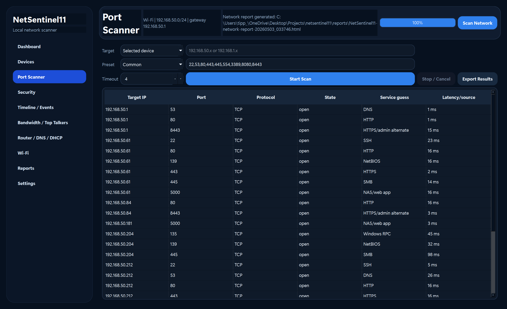

# NetSentinel11

**NetSentinel11 is a local-first Windows 11 network scanner and monitoring app built in C/C++ with a Qt 6 GUI.**

It is designed for home networks, labs, schools, community projects, and low-resource environments that need free and open-source local network visibility without cloud lock-in.

<p align="center">
  
</p>

<p align="center">
  <strong>Safe LAN discovery, device inventory, diagnostics, reports, and a polished Qt 6 Windows GUI.</strong>
</p>

<p align="center">
  <a href="LICENSE"></a>
  
  
  
</p>

## Highlights

- Modern Windows 11-style Qt 6 desktop GUI.
- Dashboard, device inventory, safe port scanner, security findings, reports, settings, and dark Windows-style workflow.
- Safe LAN discovery using local-only techniques such as ARP, ICMP, TCP liveness hints, hostname lookup, mDNS, SSDP, NetBIOS, and read-only diagnostics where available.
- Device inventory, identity merge, vendor/OUI hints, event timeline, service hints, security warnings, and report export.
- Bandwidth and top-talkers UI foundations with local-machine and router/source abstractions.
- C17 low-level boundary with a C++20 backend/service layer and GUI kept separate from scanner logic.
- Portable release package plus installer-oriented packaging path.

## Safety promise

NetSentinel11 is built for authorized local networks only.

- No exploit payloads.
- No credential brute force.
- No MITM, ARP spoofing, deauth, stealth scanning, or destructive behavior.
- No public Internet scanning by default.
- No cloud account required.
- Local scan data stays local unless the user exports it.

Use it only on networks you own or have explicit permission to test.

## Screenshots

These screenshots are from the rebuilt Qt GUI and show real authorized-LAN scanner flows. Local private IP addresses may appear; no public Internet scan data is used.

| Dashboard | Devices |
| --- | --- |
|  |  |

| Port scanner | Security findings |
| --- | --- |
|  |  |

## Release options

NetSentinel11 is intended to ship in three friendly forms:

1. **Portable Windows folder/ZIP**: unzip and double-click `NetSentinel11.exe`.
2. **Installer-style Windows package**: setup folder with install/uninstall scripts now; MSI/MSIX path prepared for signed releases.
3. **Source build from GitHub**: clone, configure with CMake, and compile with MSVC 2022.

See [Release packaging](docs/RELEASE_PACKAGING.md) for maintainer commands.

## Build from source

Minimum Windows build:

```powershell
cmake -S . -B build -G "Visual Studio 17 2022" -A x64 -DBUILD_TESTING=OFF
cmake --build build --config Release
.\build\bin\Release\netsentinel11.exe --smoke
```

Qt GUI build:

```powershell
$env:CMAKE_PREFIX_PATH = "C:\Qt\6.8.3\msvc2022_64"
cmake -S . -B build-qt -G "Visual Studio 17 2022" -A x64 -DBUILD_TESTING=OFF
cmake --build build-qt --config Release
.\build-qt\bin\Release\netsentinel11_gui.exe
```

Detailed setup is in [Build from source](docs/BUILD_FROM_SOURCE.md).

## Example local scan

```powershell
.\netsentinel11.exe gui action --id scan.trigger --target 192.168.1.0/24 --apply --confirm
```

Only scan private networks you are authorized to test.

## GitHub repository topics

Suggested GitHub topics are listed in [GitHub topics](docs/GITHUB_TOPICS.md).

Recommended topics:

```text
network-scanner windows windows-11 qt6 cpp20 c17 lan-discovery network-monitoring
network-diagnostics cybersecurity privacy-first local-first home-network open-source
mit-license
```

Recommended release tags:

```text
v0.1.0 portable installer windows-x64 qt6 safe-lan-scanner
```

## License

MIT. See [LICENSE](LICENSE).
